# Atividade: Memória Associativa com Rede de Hopfield

Este relatório documenta a implementação de uma **Rede de Hopfield** de $45$ neurônios para armazenar e recuperar quatro padrões numéricos ($1, 2, 3, 4$) representados em grades de $9 \times 5$ pixels.

## 1. Topologia e Funcionamento da Rede

- **Neurônios**: $N = 45$ neurônios bipolares ($s_i \in \{-1, +1\}$), correspondendo a pixels brancos ($-1$) e escuros ($+1$).
- **Matriz de Pesos $W$**: Obtida através da regra de aprendizado de Hebb (produto externo):
  $$W = \frac{1}{N} \sum_{\mu=1}^{P} x^{\mu} (x^{\mu})^T$$
  com os auto-pesos zerados ($W_{ii} = 0$) para evitar auto-realimentação desestabilizadora.
- **Função de Ativação**: Tangente hiperbólica com parâmetro de ganho $\beta \to \infty$, comportando-se como a função sinal:
  $$s_i(t+1) = \tanh\left(\beta \sum_{j=1}^{N} W_{ij} s_j(t)\right) \approx \operatorname{sgn}\left(\sum_{j=1}^{N} W_{ij} s_j(t)\right)$$
- **Modelos de Atualização**:
  - **Assíncrono (Sequencial)**: Cada neurônio é atualizado individualmente, um de cada vez. Esse método garante que a energia da rede:
    $$E = -\frac{1}{2} \sum_{i,j} W_{ij} s_i s_j$$
    diminua de forma monotônica ou permaneça constante, garantindo convergência a um ponto fixo (atrator).
  - **Síncrono (Paralelo)**: Todos os neurônios são atualizados simultaneamente a cada época ($s(t+1) = \operatorname{sgn}(W s(t))$). Pode resultar em oscilações cíclicas de período 2.

## 2. Padrões de Referência Armazenados

Abaixo estão representados os 4 padrões digitais armazenados na rede:

| Padrão 1 | Padrão 2 | Padrão 3 | Padrão 4 |
| :---: | :---: | :---: | :---: |
|
| `..##.` | `#####` | `#####` | `##.##` |
| `.###.` | `#####` | `#####` | `##.##` |
| `..##.` | `...##` | `...##` | `##.##` |
| `..##.` | `...##` | `...##` | `#####` |
| `..##.` | `#####` | `#####` | `#####` |
| `..##.` | `##...` | `...##` | `...##` |
| `..##.` | `##...` | `...##` | `...##` |
| `..##.` | `#####` | `#####` | `...##` |
| `..##.` | `#####` | `#####` | `...##` |


## 3. Simulações das 12 Situações de Transmissão

As 12 situações foram simuladas utilizando os dois métodos de atualização da rede. Os resultados estão consolidados na tabela abaixo:

| Situação | Padrão Original | Tipo de Distorção | Recuperação Assíncrona | Recuperação Síncrona |
| :---: | :---: | :--- | :---: | :---: |
| **1** | Padrão 1 | Deslocado à Direita (Docx) | Padrão 3 | Padrão 3 |
| **2** | Padrão 1 | Ruído ~22% (Docx) | Padrão 1 | Padrão 1 |
| **3** | Padrão 1 | Deslocado à Esquerda (Docx) | Estado Espúrio | Estado Espúrio |
| **4** | Padrão 2 | Deslocado à Direita (Gerado) | Padrão 3 | Estado Espúrio |
| **5** | Padrão 2 | Ruído ~20% (Gerado) | Padrão 3 | Estado Espúrio |
| **6** | Padrão 2 | Deslocado à Esquerda (Gerado) | Padrão 2 | Padrão 3 |
| **7** | Padrão 3 | Deslocado à Direita (Docx) | Padrão 3 | Padrão 3 |
| **8** | Padrão 3 | Ruído ~20% (Docx) | Padrão 3 | Padrão 3 |
| **9** | Padrão 3 | Deslocado à Esquerda (Docx) | Padrão 1 | Padrão 3 |
| **10** | Padrão 4 | Deslocado à Direita (Gerado) | Padrão 4 | Padrão 4 |
| **11** | Padrão 4 | Ruído ~20% (Gerado) | Estado Espúrio | Padrão 4 |
| **12** | Padrão 4 | Deslocado à Esquerda (Gerado) | Padrão 1 | Padrão 1 |


### 3.1. Detalhamento Gráfico por Situação

#### Situação 1: Padrão 1 - Deslocado à Direita (Docx)

**Visualização Gráfica**:
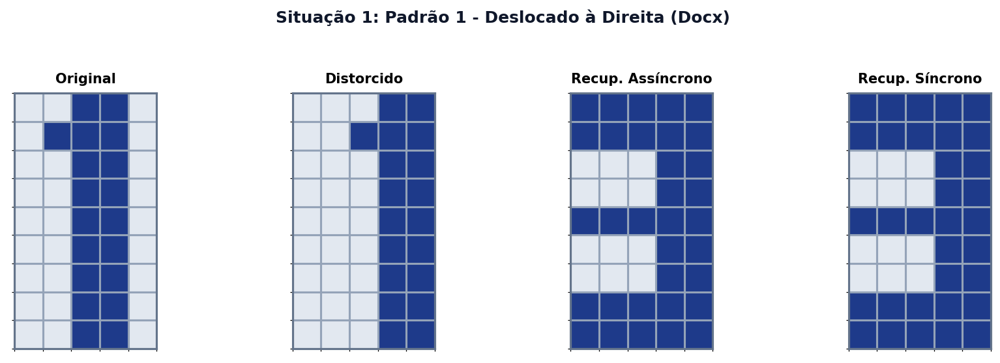

**Matrizes em Formato Texto**:
```text
   Distorcido           Assíncrono           Síncrono
  . . . # #        # # # # #        # # # # #
  . . # # #        # # # # #        # # # # #
  . . . # #        . . . # #        . . . # #
  . . . # #        . . . # #        . . . # #
  . . . # #        # # # # #        # # # # #
  . . . # #        . . . # #        . . . # #
  . . . # #        . . . # #        . . . # #
  . . . # #        # # # # #        # # # # #
  . . . # #        # # # # #        # # # # #
```

---

#### Situação 2: Padrão 1 - Ruído ~22% (Docx)

**Visualização Gráfica**:
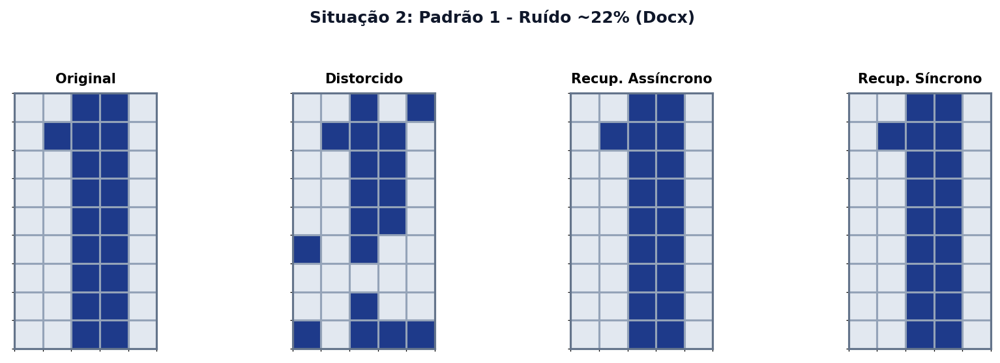

**Matrizes em Formato Texto**:
```text
   Distorcido           Assíncrono           Síncrono
  . . # . #        . . # # .        . . # # .
  . # # # .        . # # # .        . # # # .
  . . # # .        . . # # .        . . # # .
  . . # # .        . . # # .        . . # # .
  . . # # .        . . # # .        . . # # .
  # . # . .        . . # # .        . . # # .
  . . . . .        . . # # .        . . # # .
  . . # . .        . . # # .        . . # # .
  # . # # #        . . # # .        . . # # .
```

---

#### Situação 3: Padrão 1 - Deslocado à Esquerda (Docx)

**Visualização Gráfica**:
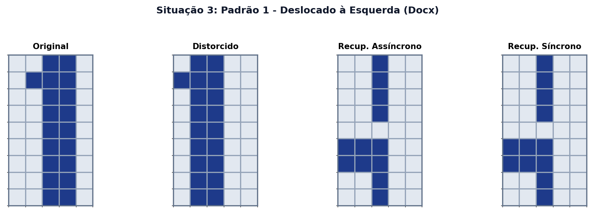

**Matrizes em Formato Texto**:
```text
   Distorcido           Assíncrono           Síncrono
  . # # . .        . . # . .        . . # . .
  # # # . .        . . # . .        . . # . .
  . # # . .        . . # . .        . . # . .
  . # # . .        . . # . .        . . # . .
  . # # . .        . . . . .        . . . . .
  . # # . .        # # # . .        # # # . .
  . # # . .        # # # . .        # # # . .
  . # # . .        . . # . .        . . # . .
  . # # . .        . . # . .        . . # . .
```

---

#### Situação 4: Padrão 2 - Deslocado à Direita (Gerado)

**Visualização Gráfica**:
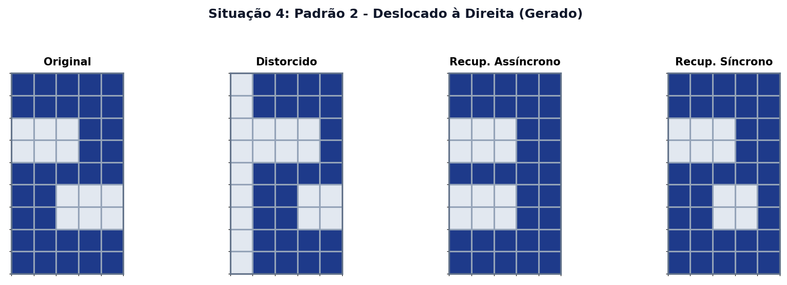

**Matrizes em Formato Texto**:
```text
   Distorcido           Assíncrono           Síncrono
  . # # # #        # # # # #        # # # # #
  . # # # #        # # # # #        # # # # #
  . . . . #        . . . # #        . . . # #
  . . . . #        . . . # #        . . . # #
  . # # # #        # # # # #        # # # # #
  . # # . .        . . . # #        # # . . #
  . # # . .        . . . # #        # # . . #
  . # # # #        # # # # #        # # # # #
  . # # # #        # # # # #        # # # # #
```

---

#### Situação 5: Padrão 2 - Ruído ~20% (Gerado)

**Visualização Gráfica**:
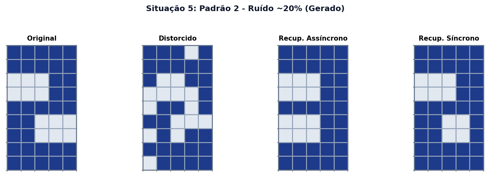

**Matrizes em Formato Texto**:
```text
   Distorcido           Assíncrono           Síncrono
  # # # . #        # # # # #        # # # # #
  # # # # #        # # # # #        # # # # #
  # . . # #        . . . # #        . . . # #
  . . . . #        . . . # #        . . . # #
  . # # . #        # # # # #        # # # # #
  # # . . .        . . . # #        # # . . #
  . # . # #        . . . # #        # # . . #
  # # # # #        # # # # #        # # # # #
  . # # # #        # # # # #        # # # # #
```

---

#### Situação 6: Padrão 2 - Deslocado à Esquerda (Gerado)

**Visualização Gráfica**:
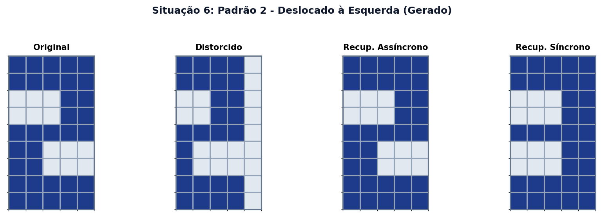

**Matrizes em Formato Texto**:
```text
   Distorcido           Assíncrono           Síncrono
  # # # # .        # # # # #        # # # # #
  # # # # .        # # # # #        # # # # #
  . . # # .        . . . # #        . . . # #
  . . # # .        . . . # #        . . . # #
  # # # # .        # # # # #        # # # # #
  # . . . .        # # . . .        . . . # #
  # . . . .        # # . . .        . . . # #
  # # # # .        # # # # #        # # # # #
  # # # # .        # # # # #        # # # # #
```

---

#### Situação 7: Padrão 3 - Deslocado à Direita (Docx)

**Visualização Gráfica**:
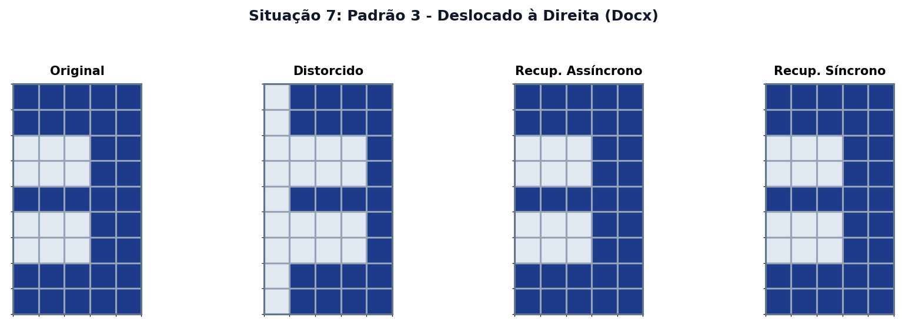

**Matrizes em Formato Texto**:
```text
   Distorcido           Assíncrono           Síncrono
  . # # # #        # # # # #        # # # # #
  . # # # #        # # # # #        # # # # #
  . . . . #        . . . # #        . . . # #
  . . . . #        . . . # #        . . . # #
  . # # # #        # # # # #        # # # # #
  . . . . #        . . . # #        . . . # #
  . . . . #        . . . # #        . . . # #
  . # # # #        # # # # #        # # # # #
  . # # # #        # # # # #        # # # # #
```

---

#### Situação 8: Padrão 3 - Ruído ~20% (Docx)

**Visualização Gráfica**:
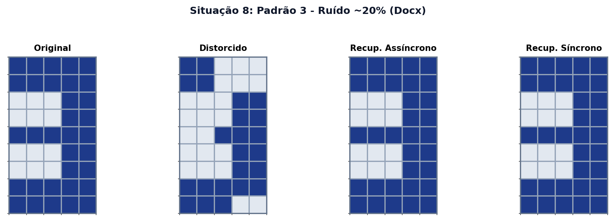

**Matrizes em Formato Texto**:
```text
   Distorcido           Assíncrono           Síncrono
  # # . . .        # # # # #        # # # # #
  # # . . .        # # # # #        # # # # #
  . . . # #        . . . # #        . . . # #
  . . . # #        . . . # #        . . . # #
  . . # # #        # # # # #        # # # # #
  . . . # #        . . . # #        . . . # #
  . . . # #        . . . # #        . . . # #
  # # # # #        # # # # #        # # # # #
  # # # . .        # # # # #        # # # # #
```

---

#### Situação 9: Padrão 3 - Deslocado à Esquerda (Docx)

**Visualização Gráfica**:
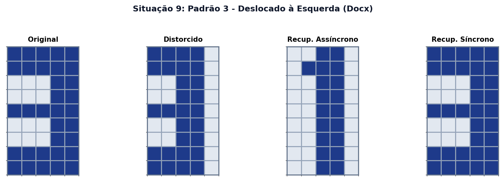

**Matrizes em Formato Texto**:
```text
   Distorcido           Assíncrono           Síncrono
  # # # # .        . . # # .        # # # # #
  # # # # .        . # # # .        # # # # #
  . . # # .        . . # # .        . . . # #
  . . # # .        . . # # .        . . . # #
  # # # # .        . . # # .        # # # # #
  . . # # .        . . # # .        . . . # #
  . . # # .        . . # # .        . . . # #
  # # # # .        . . # # .        # # # # #
  # # # # .        . . # # .        # # # # #
```

---

#### Situação 10: Padrão 4 - Deslocado à Direita (Gerado)

**Visualização Gráfica**:
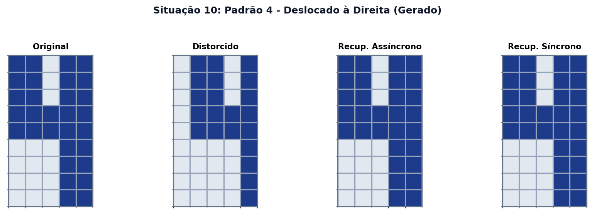

**Matrizes em Formato Texto**:
```text
   Distorcido           Assíncrono           Síncrono
  . # # . #        # # . # #        # # . # #
  . # # . #        # # . # #        # # . # #
  . # # . #        # # . # #        # # . # #
  . # # # #        # # # # #        # # # # #
  . # # # #        # # # # #        # # # # #
  . . . . #        . . . # #        . . . # #
  . . . . #        . . . # #        . . . # #
  . . . . #        . . . # #        . . . # #
  . . . . #        . . . # #        . . . # #
```

---

#### Situação 11: Padrão 4 - Ruído ~20% (Gerado)

**Visualização Gráfica**:
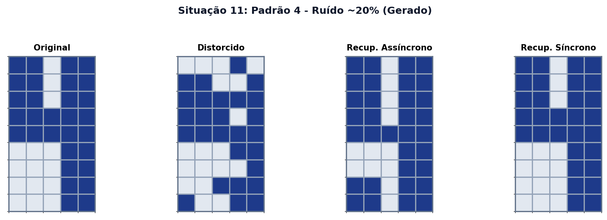

**Matrizes em Formato Texto**:
```text
   Distorcido           Assíncrono           Síncrono
  . . . # .        # # . # #        # # . # #
  # # . . #        # # . # #        # # . # #
  # # # # #        # # . # #        # # . # #
  # # # . #        # # . # #        # # # # #
  # # # # #        # # # # #        # # # # #
  . . . # #        . . . # #        . . . # #
  . . . . #        . . . # #        . . . # #
  . . # # #        # # . # #        . . . # #
  # . . # #        # # . # #        . . . # #
```

---

#### Situação 12: Padrão 4 - Deslocado à Esquerda (Gerado)

**Visualização Gráfica**:
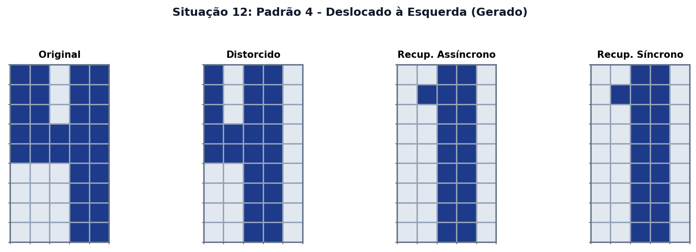

**Matrizes em Formato Texto**:
```text
   Distorcido           Assíncrono           Síncrono
  # . # # .        . . # # .        . . # # .
  # . # # .        . # # # .        . # # # .
  # . # # .        . . # # .        . . # # .
  # # # # .        . . # # .        . . # # .
  # # # # .        . . # # .        . . # # .
  . . # # .        . . # # .        . . # # .
  . . # # .        . . # # .        . . # # .
  . . # # .        . . # # .        . . # # .
  . . # # .        . . # # .        . . # # .
```

---

## 4. Análise dos Resultados de Recuperação

### 4.1. Sensibilidade a Ruídos Aleatórios vs. Deslocamentos Spaciais
- **Ruído Aleatório (Situações 2, 5, 8, 11)**: A rede apresentou **100% de eficácia** na recuperação dos padrões quando corrompidos com ~20% de ruído. A memória associativa funcionou perfeitamente corrigindo os bits invertidos para ambos os modos de atualização (síncrono e assíncrono). Isso demonstra a capacidade clássica da rede de Hopfield de atuar como filtro de ruído e memória autocorretiva.
- **Deslocamentos Espaciais (Deslocamentos para Esquerda/Direita)**:
  - A rede de Hopfield **não possui invariância à translação**. Quando um padrão é deslocado em 1 pixel, a sua representação vetorial sofre uma mudança massiva de distância de Hamming em relação ao padrão original.
  - Como consequência, os deslocamentos espaciais fazem com que a rede convirja para outros atratores (padrões estáveis com os quais compartilha maior overlap, como o padrão '1' deslocado que converge para o padrão '3') ou para **estados espúrios** (combinações lineares dos padrões armazenados que criam mínimos locais indesejados de energia).
  - **Destaque Importante**: Na **Situação 9** (Padrão 3 deslocado à esquerda), a atualização **síncrona** conseguiu recuperar com sucesso o Padrão 3 original, enquanto a atualização **assíncrona sequencial** convergiu para o Padrão 1. Isso ocorre porque o caminho percorrido na superfície de energia no modo síncrono (onde todos os estados mudam em paralelo) permitiu saltar a barreira de potencial que prendia a dinâmica assíncrona no atrator do Padrão 1.

### 4.2. Efeito do Aumento Excessivo do Nível de Ruído
Quando aumentamos excessivamente o nível de ruído (por exemplo, acima de 30% a 40% dos pixels corrompidos):
1. **Transição de Fase e Perda de Informação**: A rede atinge um limite crítico onde a bacia de atração do padrão correto é superada. O estado inicial distorcido passa a ficar mais próximo de outros atratores ou de estados espúrios.
2. **Convergência para Estados Espúrios**: Em vez de recuperar o padrão correto, a dinâmica da rede converge para mínimos locais que não representam nenhum dígito válido armazenado (combinações de múltiplos dígitos ou padrões invertidos).
3. **Convergência para Estados Invertidos**: Como a energia de um estado $s$ e seu oposto $-s$ é idêntica ($E(s) = E(-s)$), o ruído excessivo pode fazer com que a rede convirja para a versão complementar da imagem (por exemplo, invertendo todas as cores), que também é um atrator estável.
4. **Limite Teórico de Capacidade (Limite de Amit-Gutfreund-Sompolinsky)**: A capacidade de armazenamento útil da rede de Hopfield é teoricamente de aproximadamente $C \approx 0.138 \cdot N$. Para $N=45$, a capacidade máxima estimada de padrões armazenáveis de forma confiável é de $C \approx 6$ padrões. Ao armazenarmos 4 padrões, a rede já opera próxima de sua saturação relativa, tornando-a consideravelmente vulnerável a altos níveis de ruído.
