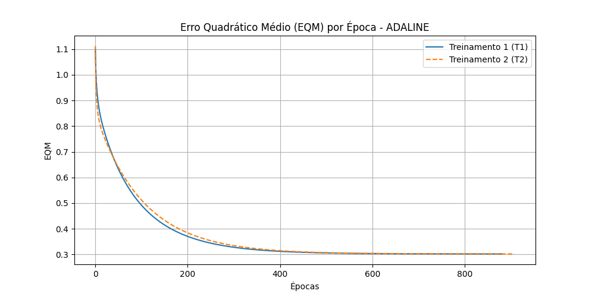

# Atividade 3 - Classificação de Sinais (Válvulas) com ADALINE

## Resultados dos 5 Treinamentos
=== TABELA 1: RESULTADOS DOS TREINAMENTOS ADALINE ===
| T | w0 ini | w1 ini | w2 ini | w3 ini | w4 ini | w0 fin | w1 fin | w2 fin | w3 fin | w4 fin | Épocas |
|---|---|---|---|---|---|---|---|---|---|---|---|
| T1 | 0.2475 | 0.0449 | 0.2687 | 0.1371 | 0.0706 | -1.8130 | 1.3128 | 1.6422 | -0.4278 | -1.1777 | 882 |
| T2 | 0.6097 | 0.7001 | 0.5082 | 0.6566 | 0.0430 | -1.8131 | 1.3129 | 1.6424 | -0.4276 | -1.1778 | 909 |
| T3 | 0.8437 | 0.4373 | 0.2964 | 0.8596 | 0.6629 | -1.8131 | 1.3129 | 1.6423 | -0.4276 | -1.1778 | 943 |
| T4 | 0.6521 | 0.3242 | 0.0587 | 0.6033 | 0.2340 | -1.8131 | 1.3129 | 1.6423 | -0.4277 | -1.1778 | 926 |
| T5 | 0.5753 | 0.8652 | 0.5655 | 0.8111 | 0.7690 | -1.8130 | 1.3129 | 1.6423 | -0.4275 | -1.1778 | 922 |

## Gráfico do Erro Quadrático Médio (T1 e T2)

## Classificação Automática para o Comutador (Teste)
=== TABELA 2: CLASSIFICAÇÃO DAS AMOSTRAS (A = -1 / B = 1) ===
| Amostra | x1 | x2 | x3 | x4 | y (T1) | y (T2) | y (T3) | y (T4) | y (T5) |
|---|---|---|---|---|---|---|---|---|---|
| 1 | 0.9694 | 0.6909 | 0.4334 | 3.4965 | -1 | -1 | -1 | -1 | -1 |
| 2 | 0.5427 | 1.3832 | 0.6390 | 4.0352 | -1 | -1 | -1 | -1 | -1 |
| 3 | 0.6081 | -0.9196 | 0.5925 | 0.1016 | 1 | 1 | 1 | 1 | 1 |
| 4 | -0.1618 | 0.4694 | 0.2030 | 3.0117 | -1 | -1 | -1 | -1 | -1 |
| 5 | 0.1870 | -0.2578 | 0.6124 | 1.7749 | -1 | -1 | -1 | -1 | -1 |
| 6 | 0.4891 | -0.5276 | 0.4378 | 0.6439 | 1 | 1 | 1 | 1 | 1 |
| 7 | 0.3777 | 2.0149 | 0.7423 | 3.3932 | 1 | 1 | 1 | 1 | 1 |
| 8 | 1.1498 | -0.4067 | 0.2469 | 1.5866 | 1 | 1 | 1 | 1 | 1 |
| 9 | 0.9325 | 1.0950 | 1.0359 | 3.3591 | 1 | 1 | 1 | 1 | 1 |
| 10 | 0.5060 | 1.3317 | 0.9222 | 3.7174 | -1 | -1 | -1 | -1 | -1 |
| 11 | 0.0497 | -2.0656 | 0.6124 | -0.6585 | -1 | -1 | -1 | -1 | -1 |
| 12 | 0.4004 | 3.5369 | 0.9766 | 5.3532 | 1 | 1 | 1 | 1 | 1 |
| 13 | -0.1874 | 1.3343 | 0.5374 | 3.2189 | -1 | -1 | -1 | -1 | -1 |
| 14 | 0.5060 | 1.3317 | 0.9222 | 3.7174 | -1 | -1 | -1 | -1 | -1 |
| 15 | 1.6375 | -0.7911 | 0.7537 | 0.5515 | 1 | 1 | 1 | 1 | 1 |

## Resposta Teórica

[cite_start]**Embora o número de épocas de cada treinamento seja diferente, explique por que então os valores dos pesos continuam praticamente inalterados.** [cite: 113]

Ao contrário do Perceptron (que para de atualizar os pesos assim que encontra qualquer hiperplano que separe os dados), o **ADALINE utiliza a Regra Delta**, cujo objetivo é minimizar o Erro Quadrático Médio (EQM) através do Gradiente Descendente. 

A superfície de erro em uma rede linear de camada única como o ADALINE forma um paraboloide, o que significa que **existe apenas um único mínimo global**. Não importa onde os pesos iniciais comecem aleatoriamente (o que altera apenas a distância e, consequentemente, o número de épocas necessárias para chegar ao fundo da "tigela"), o algoritmo sempre convergirá para o mesmo ponto ótimo de mínimo erro. Portanto, o vetor de pesos final será sempre o mesmo, ditado pelo ponto de mínimo da função matemática.