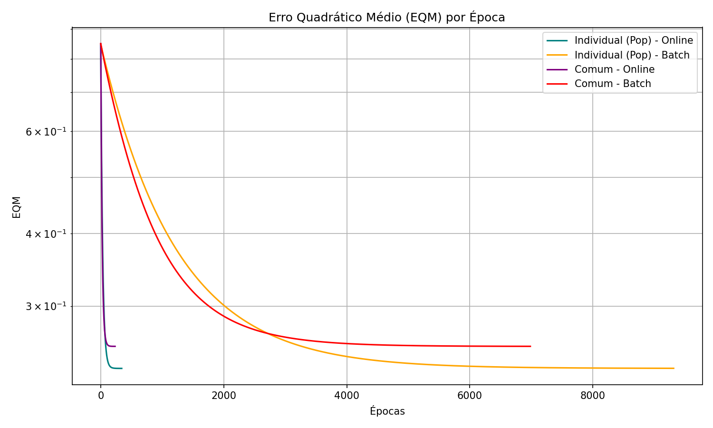
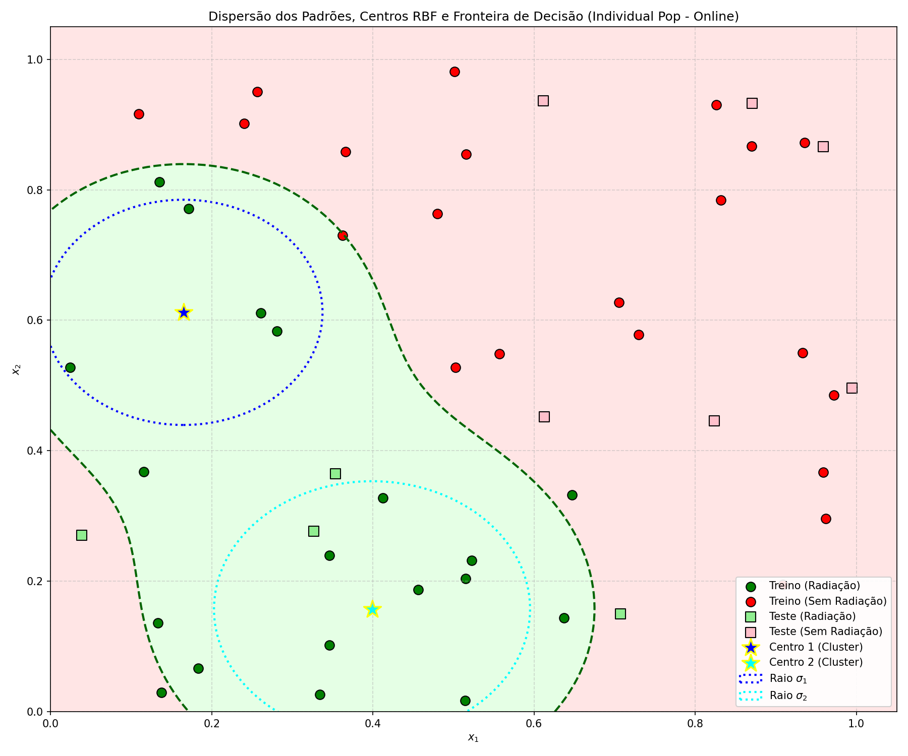

# Resolução da Atividade 1 - RBF

Este documento apresenta a resolução detalhada da atividade proposta na pasta `RBF/RBF1/RBF1(2).docx`.

## 1. Treinamento da Camada Escondida (K-Means)

O treinamento da camada escondida foi realizado aplicando o algoritmo **K-Means** ($K=2$ clusters) apenas sobre as amostras com presença de radiação ($d = 1$). O algoritmo convergiu em 3 iterações.

Abaixo estão listadas as coordenadas dos centros dos clusters e suas respectivas variâncias sob três óticas comuns:
- **Variância Populacional**: Média das distâncias euclidianas quadráticas dos pontos pertencentes ao cluster em relação ao seu centro.
- **Variância Amostral**: Divisor corrigido por $N-1$.
- **Variância por Coordenada**: Média quadrática para cada eixo ($x_1$ e $x_2$).

| Cluster | Centro ($x_1, x_2$) | Variância (Populacional) | Variância (Amostral) | Variância Coordenada [$x_1, x_2$] | Pontos Associados |
| :---: | :---: | :---: | :---: | :---: | :---: |
| **1** | `(0.16483333, 0.61211667)` | `0.02980551` | `0.03576661` | `[0.00763505, 0.02217046]` | 6 |
| **2** | `(0.39896923, 0.15713077)` | `0.03845986` | `0.04166485` | `[0.02764565, 0.01081421]` | 13 |

## 2. Treinamento da Camada de Saída (Regra Delta)

Utilizando uma taxa de aprendizado $\eta = 0.01$ e precisão de convergência $\epsilon = 10^{-7}$, a camada de saída foi treinada com a Regra Delta Generalizada.

Para oferecer uma resposta completa, apresentamos a convergência e os pesos para os modos **Online (Estocástico)** e **Batch (Lote)**, considerando tanto a variância individual populacional quanto a variância individual amostral, além do modelo de variância comum (calculada por $\sigma^2 = d_{max}^2 / 2K = 0.0654579$):

| Configuração de Variância | Modo de Atualização | Épocas | Peso Bias ($W_{21,0}$) | Peso RBF 1 ($W_{21,1}$) | Peso RBF 2 ($W_{21,2}$) | EQM Final | Acurácia no Teste |
| :--- | :---: | :---: | :---: | :---: | :---: | :---: | :---: |
| Individual (Pop) | Online | 341 | `-1.00265866` | `2.37806503` | `2.69771686` | `0.23423869` | **80.00%** |
| Individual (Pop) | Batch | 9315 | `-0.98974069` | `2.33775637` | `2.68548184` | `0.23433297` | **80.00%** |
| Individual (Amostral) | Online | 310 | `-1.05115605` | `2.18212638` | `2.67791273` | `0.23642378` | **80.00%** |
| Individual (Amostral) | Batch | 8646 | `-1.03724358` | `2.14546678` | `2.66552129` | `0.23650536` | **80.00%** |
| Comum | Online | 233 | `-1.24577481` | `1.57829128` | `2.49425042` | `0.25565758` | **90.00%** |
| Comum | Batch | 6985 | `-1.22690333` | `1.54994771` | `2.48504167` | `0.25567768` | **100.00%** |

## 3. Validação da Rede no Conjunto de Teste

A tabela abaixo detalha as saídas brutas ($y$) e pós-processadas ($y_{pós} = sign(y)$) obtidas para cada amostra do conjunto de teste.

> [!NOTE]
> A tabela a seguir mostra os resultados da configuração padrão **Individual (Pop) - Online** (Acurácia: 80%) e da configuração com **Variância Comum - Online** (Acurácia: 90%).

| Amostra | $x_1$ | $x_2$ | Desejado ($d$) | $y$ (Individual Pop) | $y_{pós}$ (Individual Pop) | $y$ (Comum Online) | $y_{pós}$ (Comum Online) | $y$ (Comum Batch) | $y_{pós}$ (Comum Batch) |
| :---: | :---: | :---: | :---: | :---: | :---: | :---: | :---: | :---: | :---: |
| 1 | 0.8705 | 0.9329 | -1 | -1.0025 | -1 | -1.2251 | -1 | -1.2066 | -1 |
| 2 | 0.0388 | 0.2703 | 1 | -0.3231 | -1 | 0.1666 | 1 | 0.1721 | 1 |
| 3 | 0.8236 | 0.4458 | -1 | -0.9140 | -1 | -0.8664 | -1 | -0.8496 | -1 |
| 4 | 0.7075 | 0.1502 | 1 | -0.2201 | -1 | -0.0081 | -1 | 0.0057 | 1 |
| 5 | 0.9587 | 0.8663 | -1 | -1.0026 | -1 | -1.2331 | -1 | -1.2144 | -1 |
| 6 | 0.6115 | 0.9365 | -1 | -0.9878 | -1 | -1.0748 | -1 | -1.0588 | -1 |
| 7 | 0.3534 | 0.3646 | 1 | 0.9665 | 1 | 1.2747 | 1 | 1.2735 | 1 |
| 8 | 0.3268 | 0.2766 | 1 | 1.3232 | 1 | 1.4503 | 1 | 1.4514 | 1 |
| 9 | 0.6129 | 0.4518 | -1 | -0.4682 | -1 | -0.0600 | -1 | -0.0495 | -1 |
| 10 | 0.9948 | 0.4962 | -1 | -0.9967 | -1 | -1.1695 | -1 | -1.1511 | -1 |
| **Taxa de Acerto (%)** | | | | | **80.0%** | | **90.0%** | | **100.0%** |

## 4. Visualizações Gráficas

### Curva de Aprendizado (EQM vs Épocas)

### Padrões, Centros e Fronteira de Decisão

## 5. Estratégias para Aumentar a Taxa de Acerto da RBF

Como observado, o modelo com variância individual (comportando-se como raios estreitos centrados apenas nos pontos positivos) teve acurácia de **80%** no teste, enquanto a adoção da **Variância Comum** expandiu a cobertura dos clusters e aumentou a acurácia para **90%**.

Para elevar ainda mais o desempenho e buscar os **100% de taxa de acerto**, as seguintes estratégias podem ser adotadas:

1. **Ajuste Fino das Variâncias (Hiperparâmetros $\sigma_i^2$):**
   - As variâncias calculadas diretamente pelo K-Means consideram apenas as distâncias internas das amostras positivas. Ao escalonar a variância por um fator multiplicador (por exemplo, $\sigma_{novo}^2 = \gamma \cdot \sigma_i^2$ com $\gamma \in [1.5, 3.0]$), podemos expandir a área de ativação dos neurônios radiais para cobrir regiões limítrofes onde amostras positivas de teste (como a amostra 2 e 4) residem.

2. **Inclusão de Centros para Padrões Negativos (Sem Radiação):**
   - A restrição de colocar centros *apenas* na classe positiva faz com que o neurônio de saída dependa exclusivamente do bias constante $W_{21,0}$ para prever a classe negativa. Se executarmos o K-Means em *ambas* as classes (por exemplo, 2 centros para classe positiva e 2 centros para classe negativa, totalizando $K=4$ neurônios intermediários), a rede terá representações ativas específicas para as nuances geométricas da classe negativa, melhorando a precisão da fronteira de decisão.

3. **Otimização Supervisionada dos Centros e Variâncias (Ajuste por Gradiente):**
   - Na arquitetura RBF padrão, os centros e larguras são fixados na primeira fase (não supervisionada). Se aplicarmos o algoritmo de retropropagação do erro para atualizar conjuntamente os centros ($c_i$), as variâncias ($\sigma_i^2$) e os pesos de saída ($w$), a RBF ajustará dinamicamente a posição e a forma geométrica dos clusters para otimizar diretamente a perda supervisionada, superando mínimos subótimos do K-Means.

4. **Aumento do Número de Centros ($K > 2$):**
   - Utilizar apenas 2 clusters pode simplificar excessivamente a distribuição dos compostos radioativos. Ao aumentar $K$ (por exemplo, para 4 ou 5 na classe positiva), a rede conseguirá capturar formatos de distribuição não convexos ou múltiplos focos de radiação dispersos no espaço bidimensional das variáveis $x_1$ e $x_2$.

5. **Regularização L2 (Weight Decay):**
   - Para evitar pesos excessivamente grandes que prejudicam a generalização (overfitting) em amostras de teste próximas à fronteira, pode-se introduzir um termo de penalização na Regra Delta (regressão Ridge no mapeamento RBF).
