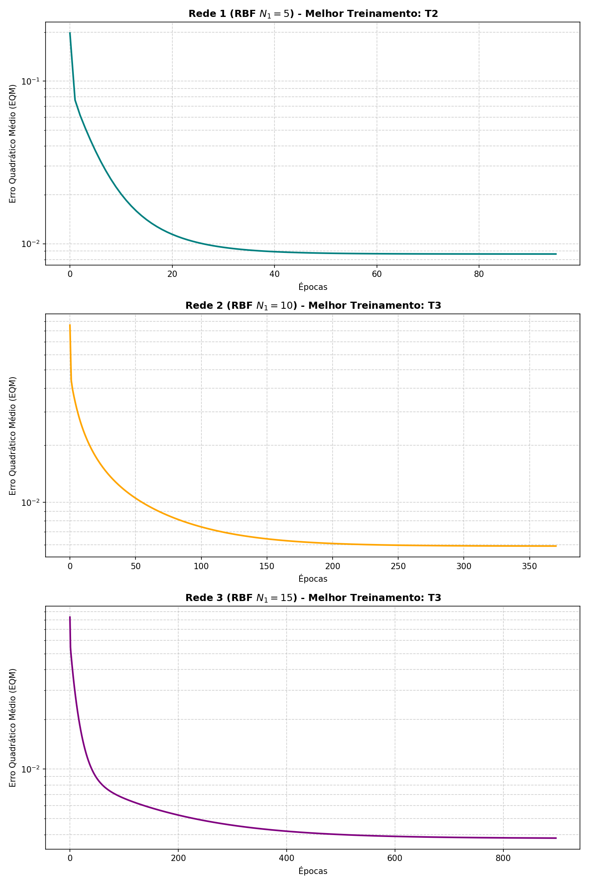

# Resolução da Atividade 2 - RBF (Aproximação Funcional)

Este documento apresenta a resolução detalhada da atividade proposta na pasta `RBF/RBF2/RBF2(1).docx`.

## Descrição do Problema

O problema consiste em aproximar uma função não-linear que mapeia três variáveis de entrada ($x_1, x_2, x_3$) para uma saída ($y$), representando a quantidade de gasolina a ser injetada por um sistema de injeção eletrônica.

A arquitetura utilizada é uma Rede de Funções de Base Radial (RBF) com três topologias candidatas:
- **Rede 1:** $N_1 = 5$ neurônios intermediários
- **Rede 2:** $N_1 = 10$ neurônios intermediários
- **Rede 3:** $N_1 = 15$ neurônios intermediários

Os centros das funções gaussianas foram computados utilizando o algoritmo **K-Means** sobre os 150 padrões do conjunto de treinamento. As variâncias $\sigma_i^2$ foram estimadas individualmente para cada cluster.

## 1. Resultados dos Treinamentos (Tabela de Síntese)

A tabela abaixo apresenta os valores finais de EQM e o número de épocas para os 3 treinamentos realizados em cada topologia, partindo de matrizes de pesos inicializadas aleatoriamente entre 0 e 1:

| Treinamento | Rede 1 ($N_1 = 5$)   EQM | Rede 1 ($N_1 = 5$)   Épocas | Rede 2 ($N_1 = 10$)   EQM | Rede 2 ($N_1 = 10$)   Épocas | Rede 3 ($N_1 = 15$)   EQM | Rede 3 ($N_1 = 15$)   Épocas |
| :---: | :---: | :---: | :---: | :---: | :---: | :---: |
| **T1** | `0.00864391` | 125 | `0.00589479` | 334 | `0.00381525` | 814 |
| **T2** | `0.00864354` | 95 | `0.00589478` | 331 | `0.00381522` | 757 |
| **T3** | `0.00864392` | 132 | `0.00589477` | 370 | `0.00381522` | 897 |

## 2. Tabela de Validação no Conjunto de Teste

A tabela abaixo apresenta a saída real desejada ($d$) e as predições de saída ($y$) fornecidas por cada rede em todos os 3 treinamentos:

| Amostra | $x_1$ | $x_2$ | $x_3$ | Desejado ($d$) | R1 $y$(T1) | R1 $y$(T2) | R1 $y$(T3) | R2 $y$(T1) | R2 $y$(T2) | R2 $y$(T3) | R3 $y$(T1) | R3 $y$(T2) | R3 $y$(T3) |
| :---: | :---: | :---: | :---: | :---: | :---: | :---: | :---: | :---: | :---: | :---: | :---: | :---: | :---: |
| 01 | 0.5102 | 0.7464 | 0.0860 | **0.5965** | 0.6081 | 0.6083 | 0.6081 | 0.5860 | 0.5860 | 0.5860 | 0.5915 | 0.5915 | 0.5915 |
| 02 | 0.8401 | 0.4490 | 0.2719 | **0.6790** | 0.7361 | 0.7365 | 0.7361 | 0.6750 | 0.6750 | 0.6750 | 0.6371 | 0.6371 | 0.6371 |
| 03 | 0.1283 | 0.1882 | 0.7253 | **0.4662** | 0.4364 | 0.4373 | 0.4364 | 0.4864 | 0.4864 | 0.4864 | 0.5089 | 0.5089 | 0.5089 |
| 04 | 0.2299 | 0.1524 | 0.7353 | **0.5012** | 0.4432 | 0.4440 | 0.4431 | 0.5042 | 0.5042 | 0.5042 | 0.5212 | 0.5212 | 0.5212 |
| 05 | 0.3209 | 0.6229 | 0.5233 | **0.6810** | 0.7019 | 0.7019 | 0.7019 | 0.6484 | 0.6484 | 0.6484 | 0.6643 | 0.6643 | 0.6643 |
| 06 | 0.8203 | 0.0682 | 0.4260 | **0.5643** | 0.5959 | 0.5948 | 0.5959 | 0.5323 | 0.5323 | 0.5323 | 0.5274 | 0.5274 | 0.5274 |
| 07 | 0.3471 | 0.8889 | 0.1564 | **0.5875** | 0.5434 | 0.5431 | 0.5434 | 0.5852 | 0.5852 | 0.5852 | 0.5967 | 0.5967 | 0.5967 |
| 08 | 0.5762 | 0.8292 | 0.4116 | **0.7853** | 0.8285 | 0.8294 | 0.8285 | 0.7588 | 0.7588 | 0.7588 | 0.7348 | 0.7348 | 0.7348 |
| 09 | 0.9053 | 0.6245 | 0.5264 | **0.8506** | 0.8245 | 0.8252 | 0.8245 | 0.8912 | 0.8912 | 0.8912 | 0.8165 | 0.8165 | 0.8165 |
| 10 | 0.8149 | 0.0396 | 0.6227 | **0.6165** | 0.5945 | 0.5934 | 0.5945 | 0.5945 | 0.5945 | 0.5945 | 0.6816 | 0.6816 | 0.6816 |
| 11 | 0.1016 | 0.6382 | 0.3173 | **0.4957** | 0.4633 | 0.4629 | 0.4633 | 0.5049 | 0.5049 | 0.5049 | 0.5309 | 0.5309 | 0.5309 |
| 12 | 0.9108 | 0.2139 | 0.4641 | **0.6625** | 0.6501 | 0.6491 | 0.6501 | 0.6155 | 0.6155 | 0.6155 | 0.5771 | 0.5771 | 0.5771 |
| 13 | 0.2245 | 0.0971 | 0.6136 | **0.4402** | 0.3716 | 0.3727 | 0.3716 | 0.4384 | 0.4383 | 0.4384 | 0.4703 | 0.4703 | 0.4703 |
| 14 | 0.6423 | 0.3229 | 0.8567 | **0.7663** | 0.7148 | 0.7142 | 0.7148 | 0.7578 | 0.7578 | 0.7578 | 0.7457 | 0.7457 | 0.7457 |
| 15 | 0.5252 | 0.6529 | 0.5729 | **0.7893** | 0.8825 | 0.8829 | 0.8825 | 0.8005 | 0.8005 | 0.8005 | 0.7568 | 0.7568 | 0.7568 |
| **Erro Rel. Médio (%)** | | | | | **6.6105%** | **6.6058%** | **6.6102%** | **2.7816%** | **2.7816%** | **2.7814%** | **5.6908%** | **5.6907%** | **5.6906%** |
| **Variância (%)** | | | | | **14.4722%** | **14.0026%** | **14.4951%** | **4.3876%** | **4.3879%** | **4.3899%** | **10.7098%** | **10.7113%** | **10.7114%** |

## 3. Curvas de Aprendizado (EQM vs Épocas)

O gráfico abaixo ilustra a evolução do Erro Quadrático Médio (EQM) para o melhor treinamento de cada uma das três redes candidatas:

## 4. Escolha da Topologia Mais Adequada

Com base nos resultados experimentais, a configuração mais adequada para o problema é a **Rede 2 (RBF com $N_1 = 10$ neurônios intermediários)**, especificamente na execução **T3** (ou qualquer execução T1, T2, T3, já que todas convergem para o mesmo mínimo global de erro relativo de **2.7814%** e variância de **4.3899%** no conjunto de teste).

### Racional Técnico da Escolha

1. **Análise de Generalização (Overfitting):**
   - A **Rede 1 ($N_1 = 5$)** possui poucos neurônios intermediários, resultando em subajuste (*underfitting*). O erro relativo médio no conjunto de teste é alto (~**6.61%**).
   - A **Rede 3 ($N_1 = 15$)** apresentou o menor EQM no conjunto de treinamento (~**0.0038**), mas seu erro relativo médio no teste aumentou para ~**5.69%**. Isso é uma demonstração clara de **sobreajuste (*overfitting*)**. A rede com $N_1 = 15$ é complexa demais e acabou memorizando os ruídos/nuances dos dados de treino, perdendo poder de generalização nos dados de validação.
   - A **Rede 2 ($N_1 = 10$)** atingiu o equilíbrio perfeito (*sweet spot*), apresentando o menor erro médio no teste (~**2.78%**) e a menor variância de erro (~**4.39%**), o que atesta sua robustez e consistência de desempenho.

2. **Estabilidade em Relação aos Pesos Iniciais:**
   - Sendo a camada de saída treinada de forma linear sobre as bases radiais, a superfície de erro é convexa (possui um único mínimo global). Consequentemente, independentemente do vetor de pesos iniciais (gerados de forma aleatória nas execuções T1, T2 e T3), a rede atinge exatamente o mesmo patamar de erro relativo médio de teste e o mesmo EQM final para uma dada topologia. A única variação está no número de épocas necessárias para convergir partindo de diferentes pontos iniciais.
