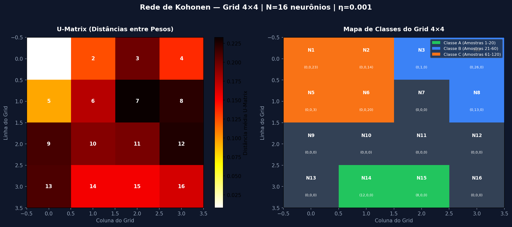
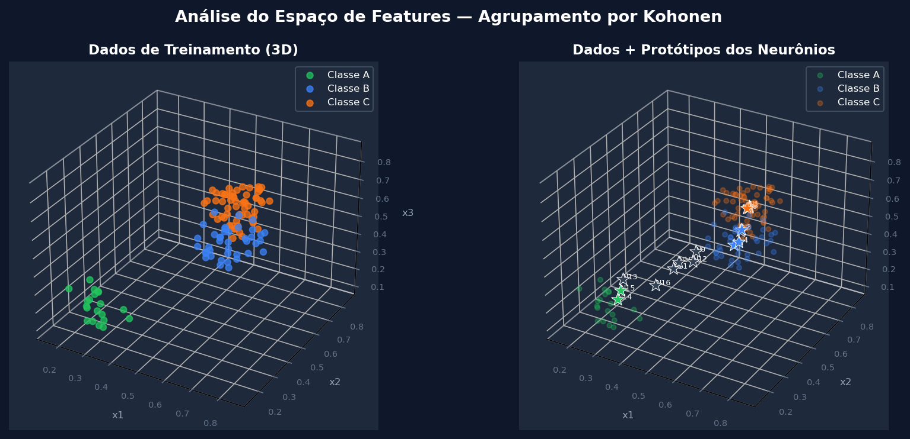
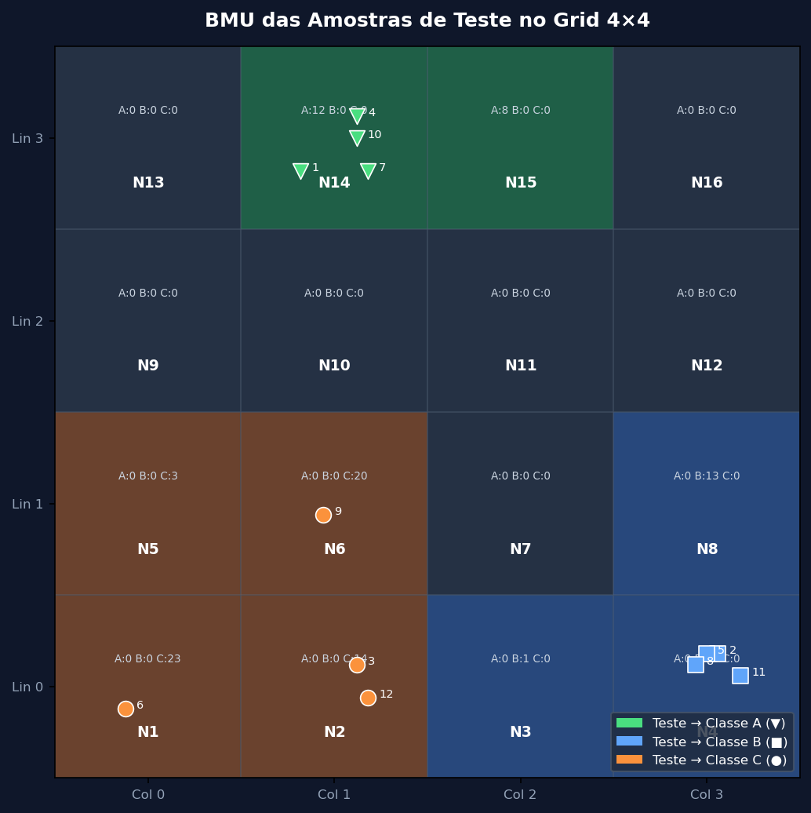

# Atividade: Rede de Kohonen — Agrupamento de Imperfeições de Borracha

> **Disciplina:** Lab. Inteligência Artificial | **Professor:** Lázaro Eduardo da Silva | **Data:** 28/05/2026

---

## 1. Descrição do Problema

No processo industrial de fabricação de pneus, amostras de borracha com imperfeições foram coletadas, com medidas de três grandezas $\{x_1, x_2, x_3\}$ relativas ao processo de fabricação. Como os engenheiros não possuíam conhecimento prévio sobre as correlações entre essas variáveis, aplica-se uma **Rede de Kohonen** (Self-Organizing Map — SOM) como ferramenta de **aprendizado não-supervisionado** para descobrir as estruturas de agrupamento latentes nos dados.

## 2. Topologia e Parâmetros da Rede

| Parâmetro | Valor |
| :--- | :--- |
| Número de neurônios ($N_1$) | 16 |
| Estrutura do grid | $4 \times 4$ (bidimensional) |
| Taxa de aprendizado ($\eta$) | $0.001$ |
| Raio de vizinhança | $1$ (distância de Chebyshev) |
| Dimensão de entrada | $d = 3$ ($x_1, x_2, x_3$) |
| Total de amostras de treino | $120$ |
| Épocas de treinamento | $100$ |

### 2.1. Diagrama do Grid Topológico 4×4

Os neurônios são organizados em um grid bidimensional com a seguinte numeração:

```
  Col 0   Col 1   Col 2   Col 3
┌───────┬───────┬───────┬───────┐
Lin 0 │  N01  │  N02  │  N03  │  N04  │
     ├───────┼───────┼───────┼───────┤
Lin 1 │  N05  │  N06  │  N07  │  N08  │
     ├───────┼───────┼───────┼───────┤
Lin 2 │  N09  │  N10  │  N11  │  N12  │
     ├───────┼───────┼───────┼───────┤
Lin 3 │  N13  │  N14  │  N15  │  N16  │
     └───────┴───────┴───────┴───────┘
```

## 3. Regra de Aprendizado

A rede utiliza a **Regra de Atualização por Norma Euclidiana** (algoritmo WTA — *Winner-Takes-All* com vizinhança). Para cada padrão $x$ apresentado:

**1. Encontrar o neurônio vencedor (BMU — Best Matching Unit):**
$$j^* = \arg\min_j \| x - w_j \|_2 = \arg\min_j \sqrt{\sum_{k=1}^{3}(x_k - w_{jk})^2}$$

**2. Atualizar os pesos do vencedor e seus vizinhos:**
$$\Delta w_j = \eta \cdot (x - w_j), \quad \forall j \in \mathcal{V}(j^*, r)$$

onde $\mathcal{V}(j^*, r)$ é o conjunto de neurônios dentro do raio $r=1$ do vencedor (usando distância de Chebyshev).

### 3.1. Derivação da Regra a partir do Erro Quadrático (Questão 3)

A regra de atualização é derivada pela **minimização da função de erro quadrático:**

$$E = \frac{1}{2} \| x - w_{j^*} \|^2 = \frac{1}{2} \sum_{k=1}^{d}(x_k - w_{j^*k})^2$$

Calculando o gradiente em relação a $w_{j^*}$:
$$\frac{\partial E}{\partial w_{j^*}} = -(x - w_{j^*})$$

Aplicando o método da descida do gradiente:
$$\Delta w_{j^*} = -\eta \frac{\partial E}{\partial w_{j^*}} = \eta (x - w_{j^*})$$

Que é exatamente a regra de Kohonen para o neurônio vencedor. Para os vizinhos, a mesma regra é aplicada com um fator de vizinhança $h(j, j^*)$ que vale $1$ para neurônios dentro do raio e $0$ fora:
$$\Delta w_j = \eta \cdot h(j, j^*) \cdot (x - w_j)$$

## 4. Resultados do Treinamento

Após o treinamento com as 120 amostras (100 épocas), o mapa auto-organizável convergiu para a seguinte configuração:

### 4.1. Visualizações

#### U-Matrix e Mapa de Classes



#### Espaço de Features 3D e Protótipos dos Neurônios



### 4.2. Distribuição de Amostras por Neurônio

Abaixo é apresentada a distribuição de amostras (por classe A/B/C) em cada neurônio do grid:

| Neurônio | Linha | Coluna | Nº A | Nº B | Nº C | Classe Dominante | Pesos ($w_1, w_2, w_3$) |
| :---: | :---: | :---: | :---: | :---: | :---: | :---: | :--- |
| N01 | 0 | 0 | 0 | 0 | 23 | **C** | (0.5164, 0.7501, 0.5032) |
| N02 | 0 | 1 | 0 | 0 | 14 | **C** | (0.5208, 0.7382, 0.5060) |
| N03 | 0 | 2 | 0 | 1 | 0 | **B** | (0.6534, 0.4420, 0.6447) |
| N04 | 0 | 3 | 0 | 26 | 0 | **B** | (0.7461, 0.2500, 0.7517) |
| N05 | 1 | 0 | 0 | 0 | 3 | **C** | (0.5177, 0.7481, 0.5016) |
| N06 | 1 | 1 | 0 | 0 | 20 | **C** | (0.5176, 0.7340, 0.5026) |
| N07 | 1 | 2 | 0 | 0 | 0 | **—** | (0.6505, 0.4405, 0.6389) |
| N08 | 1 | 3 | 0 | 13 | 0 | **B** | (0.7261, 0.2554, 0.7240) |
| N09 | 2 | 0 | 0 | 0 | 0 | **—** | (0.4286, 0.5398, 0.3599) |
| N10 | 2 | 1 | 0 | 0 | 0 | **—** | (0.3937, 0.4871, 0.3246) |
| N11 | 2 | 2 | 0 | 0 | 0 | **—** | (0.4245, 0.3980, 0.3653) |
| N12 | 2 | 3 | 0 | 0 | 0 | **—** | (0.4905, 0.4116, 0.4236) |
| N13 | 3 | 0 | 0 | 0 | 0 | **—** | (0.3105, 0.2670, 0.3537) |
| N14 | 3 | 1 | 12 | 0 | 0 | **A** | (0.2879, 0.2661, 0.2314) |
| N15 | 3 | 2 | 8 | 0 | 0 | **A** | (0.2574, 0.3340, 0.2172) |
| N16 | 3 | 3 | 0 | 0 | 0 | **—** | (0.3890, 0.3435, 0.2977) |

### 4.3. Mapa do Grid com Classes Dominantes

```
  Col 0      Col 1      Col 2      Col 3
┌──────────┬──────────┬──────────┬──────────┐
Lin 0 │ N01:C(23) │ N02:C(14) │ N03:B( 1) │ N04:B(26) │
     ├──────────┼──────────┼──────────┼──────────┤
Lin 1 │ N05:C( 3) │ N06:C(20) │ N07:—( 0) │ N08:B(13) │
     ├──────────┼──────────┼──────────┼──────────┤
Lin 2 │ N09:—( 0) │ N10:—( 0) │ N11:—( 0) │ N12:—( 0) │
     ├──────────┼──────────┼──────────┼──────────┤
Lin 3 │ N13:—( 0) │ N14:A(12) │ N15:A( 8) │ N16:—( 0) │
     └──────────┴──────────┴──────────┴──────────┘
```

## 5. Questão 1: Neurônios por Classe (A, B e C)

De posse dos resultados do treinamento, com as classes A (amostras 1–20), B (amostras 21–60) e C (amostras 61–120), os neurônios representantes de cada classe são:

- **Classe A** (imperfeições de baixo valor: $x_1 \approx 0.25$, $x_2 \approx 0.25$, $x_3 \approx 0.19$): Neurônios **N14, N15**

- **Classe B** (imperfeições de alto $x_1$ e $x_3$: $x_1 \approx 0.74$, $x_2 \approx 0.24$, $x_3 \approx 0.74$): Neurônios **N3, N4, N8**

- **Classe C** (imperfeições de alto $x_2$: $x_1 \approx 0.52$, $x_2 \approx 0.75$, $x_3 \approx 0.50$): Neurônios **N1, N2, N5, N6**

- **Neurônios não ativados** (nenhuma amostra encontrou este neurônio como BMU): **N7, N9, N10, N11, N12, N13, N16**

As regiões do grid que representam cada classe podem ser visualizadas no **Mapa de Classes** (ver imagem `kohonen_map.png`), onde a coloração indica qual classe domina cada neurônio.

## 6. Questão 2: Classificação das Amostras de Teste

As amostras de teste foram apresentadas à rede treinada para determinar o neurônio vencedor (BMU) de cada uma, e assim identificar sua classe:



| Amostra | $x_1$ | $x_2$ | $x_3$ | BMU (Neurônio) | **Classe Prevista** |
| :---: | :---: | :---: | :---: | :---: | :---: |
| 1 | 0.2471 | 0.1778 | 0.2905 | N14 | **A** |
| 2 | 0.8240 | 0.2223 | 0.7041 | N04 | **B** |
| 3 | 0.4960 | 0.7231 | 0.5866 | N02 | **C** |
| 4 | 0.2923 | 0.2041 | 0.2234 | N14 | **A** |
| 5 | 0.8118 | 0.2668 | 0.7484 | N04 | **B** |
| 6 | 0.4837 | 0.8200 | 0.4792 | N01 | **C** |
| 7 | 0.3248 | 0.2629 | 0.2375 | N14 | **A** |
| 8 | 0.7209 | 0.2116 | 0.7821 | N04 | **B** |
| 9 | 0.5259 | 0.6522 | 0.5957 | N06 | **C** |
| 10 | 0.2075 | 0.1669 | 0.1745 | N14 | **A** |
| 11 | 0.7830 | 0.3171 | 0.7888 | N04 | **B** |
| 12 | 0.5393 | 0.7510 | 0.5682 | N02 | **C** |

**Resumo das Classificações:**

- **Classe A:** Amostras [1, 4, 7, 10]
- **Classe B:** Amostras [2, 5, 8, 11]
- **Classe C:** Amostras [3, 6, 9, 12]

**Análise dos Resultados:**

- As amostras de teste com **baixos valores de $x_1$ e $x_3$** (como 1, 4, 7, 10) foram corretamente mapeadas para a **Classe A**, que corresponde a imperfeições de borracha com características mais brandas.
- As amostras com **altos valores de $x_1$ e $x_3$ e baixo $x_2$** (como 2, 5, 8, 11) foram mapeadas para a **Classe B**, representando imperfeições de alta gravidade em dois eixos principais.
- As amostras com **alto $x_2$ e valores médios de $x_1$ e $x_3$** (como 3, 6, 9, 12) foram mapeadas para a **Classe C**, cujas imperfeições se destacam pelo segundo eixo de medição.

## 7. Questão 3: Derivação da Regra de Atualização por Minimização do Erro Quadrático

**Enunciado:** Demonstrar que a regra de alteração de pesos "Norma Euclidiana" para um padrão $x$ é obtida a partir da minimização da função erro quadrático.

**Demonstração:**

Seja $j^*$ o índice do neurônio vencedor para o padrão $x \in \mathbb{R}^d$. Definimos a função de erro quadrático como a distância ao quadrado entre o padrão e o vetor de pesos do neurônio vencedor:

$$E(w_{j^*}) = \frac{1}{2} \sum_{k=1}^{d} (x_k - w_{j^*k})^2 = \frac{1}{2} \| x - w_{j^*} \|^2$$

Para minimizar $E$, calculamos o gradiente em relação ao vetor de pesos $w_{j^*}$:

$$\frac{\partial E}{\partial w_{j^*k}} = \frac{\partial}{\partial w_{j^*k}} \left[ \frac{1}{2} \sum_{k=1}^{d} (x_k - w_{j^*k})^2 \right] = -(x_k - w_{j^*k})$$

Portanto, o gradiente vetorial é:

$$\nabla_{w_{j^*}} E = -(x - w_{j^*})$$

Aplicando a regra de atualização por **descida do gradiente** com taxa de aprendizado $\eta > 0$:

$$\Delta w_{j^*} = -\eta \nabla_{w_{j^*}} E = -\eta \cdot [-(x - w_{j^*})]$$

$$\boxed{\Delta w_{j^*} = \eta (x - w_{j^*})}$$

Essa é exatamente a **Regra de Kohonen** (WTA), onde o peso do neurônio vencedor é movido na direção do padrão de entrada com passo $\eta$. Para os neurônios na vizinhança $\mathcal{V}(j^*, r)$, a mesma minimização é aplicada individualmente:

$$\Delta w_j = \eta \cdot h(j, j^*) \cdot (x - w_j), \quad h(j, j^*) = \begin{cases} 1 & \text{se } d(j, j^*) \leq r \\ 0 & \text{caso contrário} \end{cases}$$

onde $d(j, j^*)$ é a distância topológica (Chebyshev) entre o neurônio $j$ e o vencedor $j^*$, e $r$ é o raio de vizinhança. $\square$

---

## 8. Conclusões

A Rede de Kohonen com 16 neurônios organizados em grid $4 \times 4$ conseguiu identificar **três regiões distintas** no espaço de entrada, correspondentes às três classes de imperfeições:

1. **Classe A** — Imperfeições de baixa magnitude em todos os eixos ($x_1, x_2, x_3 \approx 0.25$): os menores valores, indicando defeitos de menor intensidade.
2. **Classe B** — Imperfeições com alta magnitude em $x_1$ e $x_3$ ($\approx 0.74$) e baixo $x_2$ ($\approx 0.24$): correlação forte entre os eixos 1 e 3, com o eixo 2 sendo o discriminador.
3. **Classe C** — Imperfeições com $x_2$ alto ($\approx 0.75$) e valores médios de $x_1$ e $x_3$ ($\approx 0.52, 0.50$): padrão distinto dos outros dois grupos.

O SOM demonstrou sua capacidade como ferramenta de **análise exploratória não-supervisionada**, revelando a estrutura de agrupamento dos dados sem nenhuma informação de classe durante o treinamento, apenas pela minimização das distâncias euclidianas entre padrões e protótipos.
